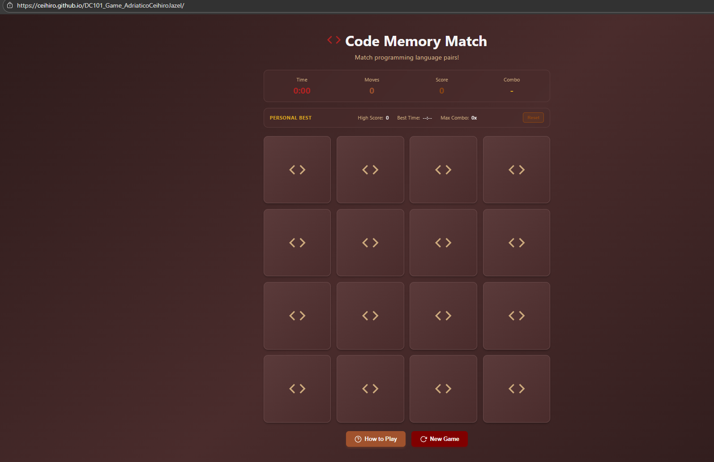

# Code Memory Match

### DC 101 - Web Development

Adriatico, Ceihiro Jazel  
January 2026

---

---

## Overview

A programmer memory matching game built with HTML, CSS, and JavaScript.  
Test your memory by matching programming language pairs while racing against time and building combos!

---

## Game Features

- 8 Programming Languages: JavaScript, Python, Java, C++, C, C#, PHP, and Swift
- Bonus points for consecutive matches
- Race against the clock

---

## Technologies used

- **HTML** - Semantic markup structure
- **CSS** - Styling, animations, and responsive design
- **JavaScript** - Game logic and interactivity

---

## How to Play

1. Click on any card to flip it and reveal the programming language
2. Click on a second card to try to find its match
3. If the cards match, they stay flipped and you earn points
4. If they don't match, they flip back over
5. Build combos by making consecutive matches for bonus points
6. Match all 8 pairs to win the game!

### Scoring System

- **Match**: 100 points
- **2x Combo**: 150 points (+50 bonus)
- **3x Combo**: 200 points (+100 bonus)
- **4x+ Combo**: +50 points per level

**Note**: Missing a match resets your combo back to 0!

---

## Play Online

Visit the live demo: [https://ceihiro.github.io/DC101_Game_AdriaticoCeihiroJazel/](https://ceihiro.github.io/DC101_Game_AdriaticoCeihiroJazel/)

---

## References

Codynn (2025). *Build Memory Game Project | HTML CSS JavaScript Fun Game for Beginners 2025*. YouTube. 

https://www.youtube.com/live/rcWBLFXH7uA

